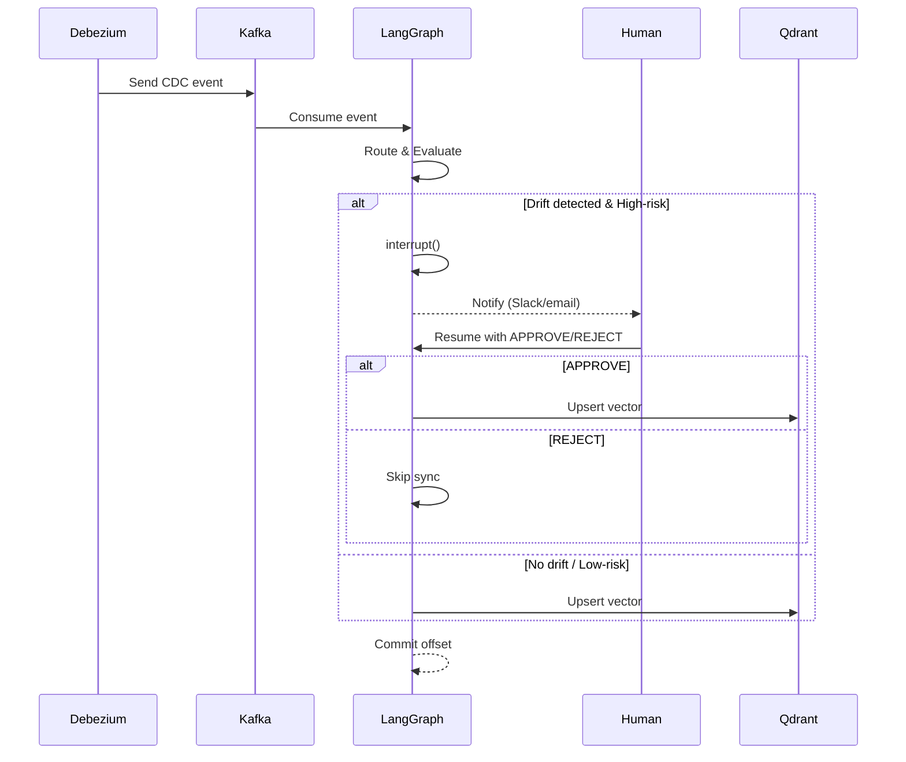

# Semantic Sync

[](https://www.python.org/downloads/)
[](https://langchain-ai.github.io/langgraph/)
[](https://fastapi.tiangolo.com/)
[](https://opensource.org/licenses/MIT)

**Semantic Sync** is a production-ready, event-driven pipeline that consumes Change Data Capture (CDC) events from Debezium (via Kafka), evaluates the **semantic drift** between the `BEFORE` and `AFTER` states of a database row, and conditionally synchronises a vector index (Qdrant) only when the change is meaningful. It avoids costly and noisy updates, provides human-in-the-loop (HITL) approval for sensitive modifications, and is built with resilience, observability, and scalability at its core.

---

## Why We Built This

Modern data architectures often stream every database mutation to a vector database to power semantic search, RAG, and recommendation engines. However, a naive "sync-all" approach suffers from:

- **Noise**: Up to 80% of updates are cosmetic (whitespace, typos, rephrasing) – they don't change the underlying meaning but still trigger expensive embedding generation and index writes.
- **Cost**: Unnecessary LLM calls for semantic evaluation and constant embedding generation inflate cloud bills.
- **Risk**: Critical changes (legal clauses, financial figures, compliance rules) need human approval before propagating to production vectors.
- **Scale**: Large payloads can overflow LLM context windows, forcing ad-hoc truncation.

**Semantic Sync** solves these problems by injecting intelligence into the sync process: it uses an LLM to determine if an update carries new facts, figures, or logic – and only then proceeds to synchronise. For high-risk updates, it pauses for human review. The result is a lean, cost-effective, and auditable pipeline.

---

## Key Metrics (Typical)

| Metric | Improvement |
| :--- | :--- |
| **Vector DB write reduction** | Up to 80% (cosmetic updates filtered out) |
| **LLM inference cost savings** | Up to 90% (via caching and short-circuit) |
| **Human-in-the-loop latency** | Minimal – external approval can be asynchronous |
| **Token budget guard** | Prevents context-overflow errors for large payloads |
| **End-to-end latency** | ~200-500 ms per event (excluding LLM call) |
| **Caching hit rate** | >70% for repeated before/after pairs in production |

*Metrics are based on typical document-update workloads and may vary with data characteristics.*

---

## Features

- **Semantic-Aware Filtering** – Uses an LLM (OpenAI-compatible) to decide if a change is meaningful; short-circuits the pipeline when no drift is detected.
- **Human-in-the-Loop (HITL)** – Suspends execution for high-risk updates (e.g., `department="LEGAL"`) and resumes after manual `APPROVE`/`REJECT`.
- **Cost Optimisation** – In-memory caching of evaluation results, token budget checks, and lazy embedding generation.
- **Scalable Architecture** – Kafka-based event ingestion, async processing, and horizontal scaling for both API and consumer.
- **Resilience** – Retry logic with exponential backoff for LLM and Qdrant operations; manual offset commit for at-least-once delivery.
- **Observability** – Structured logging with correlation IDs, health checks, and pluggable metrics (Prometheus ready).
- **Testability** – Comprehensive unit and integration tests with mocks and in-memory checkpointer.

---

## Architecture Overview

The system consists of three main components: **Event Ingestion** (Kafka & API), **Graph Orchestration** (LangGraph), and **Vector Synchronisation** (Qdrant). The diagram below shows the flow of a CDC event through the pipeline.

```mermaid
flowchart TD
    A[PostgreSQL Database] -->|CDC| B[Debezium]
    B -->|Kafka topic| C[Kafka Broker]
    C --> D{Kafka Consumer or API}
    D -->|HTTP POST /api/v1/event| E[FastAPI Server]
    D -->|Direct invoke| F[LangGraph State Machine]
    E --> F

    subgraph F[LangGraph State Machine]
        direction LR
        R[Router Node] -->|INSERT / DELETE / LARGE_UPDATE| S[Sync Node]
        R -->|UPDATE| Eval[Evaluator Node\n(LLM)]
        Eval -->|No Drift| END1[End]
        Eval -->|Drift| HITL{HITL Enabled?}
        HITL -->|Yes & High-risk| H[Human-in-the-Loop Node\n(interrupt)]
        H -->|APPROVE| S
        H -->|REJECT| END2[End]
        HITL -->|No / Low-risk| S
        S -->|Upsert / Delete| Q[Qdrant Vector DB]
    end

    Q --> Z[Search / RAG Applications]
```

---

## Project Structure

```
semantic_sync/
├── api/
│   └── server.py              # FastAPI app (ingestion & resume)
├── core/
│   ├── config.py              # Pydantic settings (env vars)
│   ├── edges.py               # Conditional graph routing
│   ├── graph.py               # LangGraph state machine builder
│   ├── prompts.py             # LLM prompt templates
│   ├── schemas.py             # CDC payload validation
│   └── state.py               # TypedDict for graph state
├── nodes/
│   ├── evaluator.py           # Semantic drift LLM node
│   ├── hitl.py                # Human-in-the-loop node
│   ├── router.py              # Initial routing node
│   └── sync.py                # Vector DB sync node
├── services/
│   └── llm_service.py         # LLM wrapper with caching & retries
├── tests/
│   └── test_pipeline.py       # Full integration tests
├── worker/
│   └── kafka_consumer.py      # Standalone Kafka consumer
├── .env.example               # Environment variables template
├── requirements.txt
└── README.md
```

---

## Quick Start

### Prerequisites
- Python 3.10+
- PostgreSQL 14+ (for LangGraph checkpoints)
- Kafka (or Redpanda)
- Qdrant (local or cloud)
- OpenAI API key

### 1. Clone & Install
```bash
git clone https://github.com/your-org/semantic-sync.git
cd semantic-sync
python -m venv venv
source venv/bin/activate  # or venv\Scripts\activate on Windows
pip install -r requirements.txt
```

### 2. Set Up Environment
Copy `.env.example` to `.env` and fill in your credentials:
```bash
cp .env.example .env
```
Edit `.env` with your PostgreSQL, Kafka, Qdrant, and OpenAI details.

### 3. Prepare Databases & Topics
- Create PostgreSQL database `semantic_sync`.
- Create Kafka topic (e.g., `debezium.public.documents`).
- Ensure Qdrant is running.

### 4. Run the API Server
```bash
uvicorn api.server:app --host 0.0.0.0 --port 8000 --reload
```

### 5. Run the Kafka Consumer (optional)
```bash
python -m worker.kafka_consumer
```

### 6. Run Tests
```bash
pytest tests/test_pipeline.py -v
```

---

## Configuration

All settings are managed via environment variables. See `.env.example` for a full list.

| Variable | Description | Default |
| :--- | :--- | :--- |
| `OPENAI_API_KEY` | Your OpenAI API key | – |
| `POSTGRES_CHECKPOINT_URL` | PostgreSQL connection string | – |
| `KAFKA_BOOTSTRAP_SERVERS` | Kafka broker(s) | `localhost:9092` |
| `KAFKA_TOPIC` | CDC topic to consume | `debezium.public.documents` |
| `VECTOR_DB_URL` | Qdrant endpoint | – |
| `VECTOR_DB_API_KEY` | Qdrant API key (if needed) | – |
| `EVALUATOR_MODEL` | OpenAI model for evaluation | `gpt-4o-mini` |
| `EMBEDDING_MODEL` | OpenAI embedding model | `text-embedding-3-small` |
| `COLLECTION_NAME` | Qdrant collection name | `enterprise_docs` |
| `HITL_ENABLED` | Enable human-in-the-loop | `true` |
| `MAX_CONTEXT_TOKENS` | Token budget before force sync | `100000` |
| `CACHE_TTL_SECONDS` | Evaluation cache TTL (seconds) | `3600` |
| `LOG_TEXT_MAX_LENGTH` | Truncate content in logs | `200` |

---

## API Endpoints

### `POST /api/v1/event`
Submit a CDC event (Debezium payload). Returns a `thread_id` for tracking.
```json
{
  "op": "u",
  "ts_ms": 1700000000000,
  "before": {"id": "123", "content": "Old text", "department": "ENG"},
  "after": {"id": "123", "content": "New text", "department": "ENG"}
}
```
Response:
```json
{"status": "accepted", "thread_id": "550e8400-e29b-41d4-a716-446655440000"}
```

### `POST /api/v1/graph/resume/{thread_id}`
Resume a suspended graph (HITL) with a human decision.
```json
{"action": "APPROVE"}  // or "REJECT"
```

### `GET /api/v1/health`
Health check.

---

## Human-in-the-Loop (HITL)

When a high-risk update (e.g., `department="LEGAL"`) with semantic drift is detected, the graph triggers an `interrupt()`. The thread is stored in PostgreSQL and must be resumed externally. An automated notification (e.g., Slack) can be fired from the `hitl.py` node. Once a human reviews the change, they call the resume endpoint with `APPROVE` or `REJECT`. The pipeline then continues accordingly.

The sequence diagram below illustrates the HITL interaction:



---

## Testing

The project includes a full test suite using `pytest` with mocks for external services. Tests cover:
- All operation types (`INSERT`, `UPDATE`, `DELETE`, `LARGE_UPDATE`, `INVALID`)
- Semantic drift evaluation (with and without drift)
- HITL interrupt and resume
- Token budget enforcement
- Edge cases (empty content, missing fields)

Run tests with:
```bash
pytest tests/ -v --cov=semantic_sync
```

---

## Deployment

- **API Server**: Deploy as a FastAPI application (e.g., using `uvicorn` with multiple workers). Stateless – scale horizontally.
- **Kafka Consumer**: Run as a separate long-running service. Scale by increasing partitions and consumer instances.
- **Checkpointer**: Uses PostgreSQL; ensure connection pooling is tuned for your load.
- **Monitoring**: Add Prometheus metrics via `prometheus_client` and expose a `/metrics` endpoint.

---

## Contributing

We welcome contributions! Please open an issue or submit a pull request. Ensure your code passes the test suite and adheres to the project's coding standards.

---

## License

This project is licensed under the MIT License – see the [LICENSE](LICENSE) file for details.

---

## Acknowledgments

Built with LangGraph, FastAPI, Qdrant, and Apache Kafka.

---

*Semantic Sync – because not every database change deserves a vector update.*
